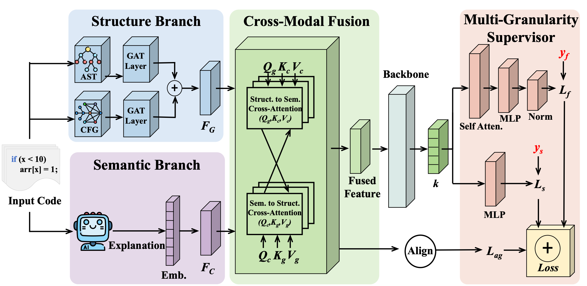

```bash
project/
├── train.py
├── data_loader.py
├── README.md
├── requirements.txt
├── models/
│   ├── control_pathway.py
│   ├── semantic_pathway.py
│   ├── feature_fusion_module.py
│   ├── transformer_llm_module.py
│   └── multi_task_predictor.py
```

# Data and Model Sources

## Dataset

We use the LineVul dataset for vulnerability detection:

> Michael Fu and Chakkrit Tantithamthavorn, "LineVul: A Transformer-based Line-Level Vulnerability Prediction", MSR 2022.  
> Paper: https://conf.researchr.org/details/msr-2022/msr-2022-technical-papers/26/LineVul-A-Transformer-based-Line-Level-Vulnerability-Prediction  
> Repository: https://github.com/awsm-research/LineVul

We further preprocess the dataset into graph structures and align each sample with LLM-generated explanations.

## Models

We use the following pretrained models:

* OpenAI GPT-4o-mini  
  > OpenAI, "Hello GPT-4o", 2024.  
  > URL: https://openai.com/index/hello-gpt-4o/  
  
  * gpt-4o-mini-2024-07-18: used for generating LLM explanations.

* Qwen Models (Qwen3 series)  
  > Qwen Team, "Qwen3 Technical Report", arXiv:2505.09388, 2025.  
  Paper: https://arxiv.org/abs/2505.09388  
  Repository: https://github.com/QwenLM/Qwen3  

  * Qwen3.5-4B: used as the semantic embedding backbone (embedding layer only).

* **GraphCodeBERT**  
  > Guo et al., "GraphCodeBERT: Pre-training Code Representations with Data Flow", ICLR 2021.   
  > Paper: https://arxiv.org/abs/2009.08366  
  > Repository: https://github.com/microsoft/CodeBERT  

## Licenses

This project uses publicly available datasets and pretrained models. Their licenses are listed below:

* **LineVul Dataset**  
  License: MIT License  
  Source: https://github.com/awsm-research/LineVul  
  
* **OpenAI GPT-4o-mini**  
  Usage is subject to the [OpenAI Terms of Use](https://openai.com/policies/terms-of-use).

* **Qwen Models (Qwen3.5-4B)**  
  License: Apache License 2.0  
  Source: https://github.com/QwenLM/Qwen3  

* **GraphCodeBERT**  
  License: MIT License  
  Source: https://github.com/microsoft/CodeBERT  

All assets are used in accordance with their respective licenses.

# Environment Setup

## Requirements

```bash
python >= 3.9

torch>=2.0.0
torch-geometric>=2.4.0

transformers>=4.35.0
accelerate>=0.25.0
sentencepiece

pandas>=1.5.0
tqdm>=4.60.0

tensorboard
```
## PyTorch Geometric Installation
PyTorch Geometric (PyG) depends on CUDA. Please install it according to your environment.

# Data Preparation

## Directory Structure

```bash
data/
├── processed/
│   ├── train_data_masked.pt
│   ├── train_with_llm.csv
│   ├── val_data_masked.pt
│   ├── val_with_llm.csv
│   ├── test_data_masked.pt
│   ├── test_with_llm.csv
├── config/
│   └── node_vocab.json
```

## CSV Format

The CSV file must contain the following fields:

* `index`: unique sample ID
* `func_before`: source code
* `llm_explanation`: LLM-generated explanation

## Graph Data (.pt)

Each PyG Data object must include:

* `index`: aligned with CSV
* `x`: node features
* `ast_edge_index`: AST edges
* `cfg_edge_index`: CFG edges
* `y_f`: function-level label
* `y_s`: line-level labels
* `line_mask`: token-to-line mapping

# Model Configuration

The framework uses the following pretrained models:

* Semantic Pathway: `Qwen/Qwen3.5-4B`
* Transformer Module: `microsoft/graphcodebert-base`

You can modify them via:

```bash
--llm_model_name
--transformer_base_name
```

# Quickstart

```bash
python train.py \
  --train_pt_path ./data/processed/train_data_masked.pt \
  --train_csv_path ./data/processed/train_with_llm.csv \
  --valid_pt_path ./data/processed/val_data_masked.pt \
  --valid_csv_path ./data/processed/val_with_llm.csv \
  --vocab_path ./data/config/node_vocab.json \
  --output_dir ./outputs \
  --run_name demo
```

# Output

Results will be saved to:

```bash
outputs/<run_name>/
```

Including:

* model checkpoints
* logs
* result.json
